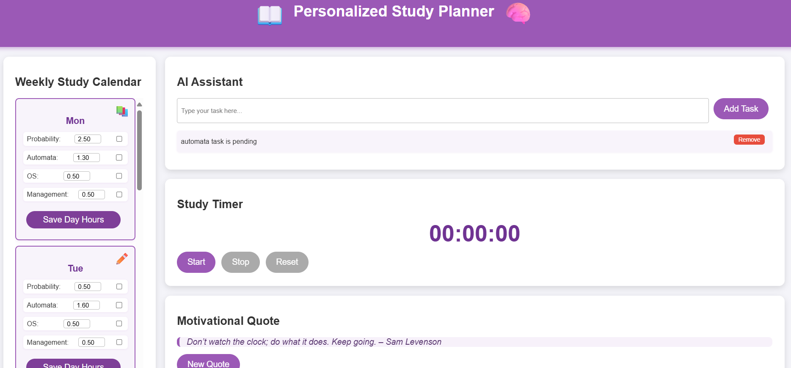

# 📖 Personalized Study Planner 🧠

A dynamic and interactive web application that helps students plan their weekly study schedule, manage tasks, and stay motivated with quotes and rewards. Built with only HTML, CSS, and JavaScript — no backend required!

---

## 📸 Preview

Here's how the planner looks:




---

## ✨ Features

- 📅 **Weekly Study Calendar**  
  Customize daily study hours per subject with visual feedback.

- ✅ **Task Manager**  
  Add and delete to-do tasks easily.

- ⏱️ **Study Timer**  
  Start, pause, and reset a timer to manage focused sessions.

- 💬 **Motivational Quotes**  
  Refreshes a new quote for daily inspiration.

- 🎁 **Completion Rewards**  
  Receive reward messages upon completing all daily study goals.

- 🧠 **Local Storage Support**  
  Saves your schedule, tasks, and progress directly in the browser.

---

## 🛠️ Tech Stack

- **HTML5**
- **CSS3**
- **JavaScript (ES6)**
- **LocalStorage API**

---

## 🚀 Getting Started

1. **Clone the repo:**

   ```bash
   git clone https://github.com/your-username/study-planner.git

2.Open the app:

 ```bash
cd study-planner
open index.html
 ```

3.No dependencies or installation required.

